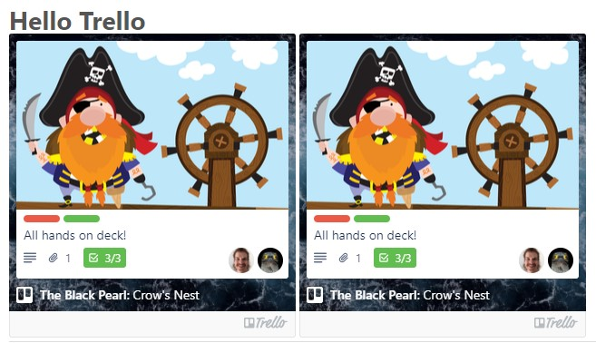

# hexo-tag-trello
[](https://github.com/welksonramos/hexo-tag-trello/actions/workflows/linter.yml) [](https://www.npmjs.com/package/hexo-tag-trello) [](https://raw.github.com/welksonramos/hexo-tag-trello/blob/master/LICENSE)

Display Trello cards in your [Hexo](https://hexo.io) blog

<p align="center">

</p>

## Install
In your blog folder, add this npm dependency to your project

```
$ npm i hexo-tag-trello --save
```

## Usage

```

```

## Options

| name | Description | Required | Type  | Default |
 ------ | ---------- | -------- | ------- | ------- |
| `url` | The URL from trello card | Yes  | `string`  | Undefined
| `compact` | The mode for embedded Trello card | No | `boolean` | `false`

# Example

There are two modes for embedded Trello cards. The default, `interactive mode`, which depending on the viewing members permissions will allow folks to vote on, watch / unwatch, join / leave, and even comment on the card:

Default (interactive mode): 
```

``` 
As well as the non-interactive, `compact` mode:

```

```

## Configuration
You can configure default settings for displaying your Trello cards in ```_config.yml```

```yml
trello:
  compact: true

```
## License
© Licensed under the MIT License.
